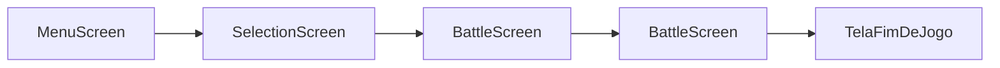
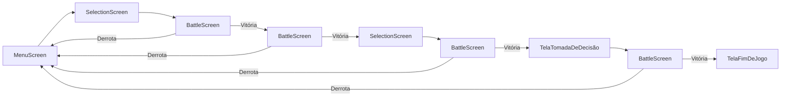

# 🧩 Projetinho Digimon

## 1. Visão Geral
**Tipo:** Jogo de batalhas de turnos (inspirado em Pokémon)  
**Plataforma:** Web (React + Vite)

O jogador escolhe Digimons e enfrenta batalhas em turnos contra oponentes controlados pelo sistema.  
O foco inicial é o funcionamento básico do loop: seleção → batalha → fim de jogo.

---

## 2. Estrutura Geral de Telas

| Tela | Descrição |
|------|------------|
| **MenuScreen** | Tela inicial com o botão “Começar”. |
| **SelectionScreen** | Tela onde o jogador escolhe um Digimon. |
| **BattleScreen** | Tela onde ocorre a batalha. |
| **TelaFimDeJogo** | Tela exibida ao terminar a jornada (vitória ou derrota). |
| **TelaTomadaDecisao** | (Planejada) Tela onde o jogador fará escolhas que alteram o fluxo do jogo. |

---

## 3. Fluxo de Telas

### 🔹 Protótipo (primeira versão a ser construída)


### 🔹 Versão 2 (a ser construída)

O Digimon escolhido na E (SelectionScreen) será o segundo Digimon do jogador.
As batalhas F e H serão 2x2.

## 4. Estrutura de Dados
### 4.1. Digimons (digimons.json)
```json
{
  "id": 1,
  "name": "Agumon",
  "image": "/src/assets/digimons/agumon.png",
  "level": 1,
  "type": "fire",
  "hp": 100,
  "atk": 25,
  "def": 15,
  "speed": 10,
  "attacks": ["pepper_breath", "claw_swipe"]
}
```
### 4.2. Ataques (attacks.json)
```json
{
  "id": "pepper_breath",
  "name": "Pepper Breath",
  "power": 20,
  "type": "fire",
  "range": 1
}
```

## 5. Estrutura de Pastas (atual)
```plaintext
C:.
|   .gitignore
|   eslint.config.js
|   estrutura.txt
|   index.html
|   package-lock.json
|   package.json
|   README.md
|   vite.config.js
|
+---public
|       vite.svg
|
\---src
    |   App.css
    |   App.jsx
    |   main.jsx
    |
    +---assets
    |   \---digimons
    +---components
    |       GameLayout.css
    |       GameLayout.jsx
    |       MenuButton.jsx
    |       MenuButton.module.css
    |
    +---context
    |       DigimonContext.jsx
    |       GameContext.jsx
    |
    +---data
    |       digimons.json
    |
    \---screens
            MenuScreen.css
            MenuScreen.jsx
            SelectionScreen.css
            SelectionScreen.jsx
```

/assets/digimons conterá as imagens dos Digimons.
/data conterá os JSONs de Digimons e ataques.

## 6. Contextos e Componentes
| Contexto / Componente           | Função                                                                                                                 |
| ------------------------------- | ---------------------------------------------------------------------------------------------------------------------- |
| **GameLayout**                  | Envolve as telas e aplica o CSS base do jogo.                                                                          |
| **GameContext**                 | Mantém o estado global de tela atual (`currentScreen`) e funções de navegação (`goToSelection`, etc.).                 |
| **DigimonContext**              | Guarda os Digimons do jogador (`digimon1` e `digimon2`) e a função `selectDigimon(digimon)`.                           |
| **BattleScreen**                | Exibe os Digimons e controla o loop da batalha. No futuro, terá um componente específico para gerenciar turnos e dano. |
| **MenuScreen**                  | Tela inicial com o botão de início.                                                                                    |
| **SelectionScreen**             | Mostra até 6 Digimons disponíveis para escolha.                                                                        |
| **BattleManager** *(planejado)* | Componente responsável pela lógica da batalha: turnos, ataques, cálculo de dano e verificação de vitória/derrota.      |

## 7. Observações Futuras

Limite de Digimons na seleção: 6 por tela, mesmo que existam mais no JSON.

Possível expansão: inclusão de atributos como experiência, elementos, efeitos de tipo, etc.

Gerenciamento de batalha: poderá ser feito por um componente dedicado (BattleManager) ou hook customizado (useBattle).

GameContext ou DigimonContext podem futuramente armazenar progresso, inventário e status persistentes do jogador.

